# Laporan Analisis dan Perancangan UML Sistem Presensi Siswa

**(Fokus: Validasi Lokasi dengan Algoritma Haversine)**

---

## 1. Daftar Final 7 Use Case dan Aktornya

Sesuai dengan analisis source code dan batasan penelitian, berikut adalah 7 Use Case utama yang berfokus pada sistem presensi siswa:

1. **Login**
   - **Aktor:** Administrator, Guru, Siswa, Orang Tua/Wali
   - **Deskripsi:** Proses otentikasi untuk masuk ke dalam sistem SIAKAD sesuai hak akses.
2. **Kelola Data Master**
   - **Aktor:** Administrator
   - **Deskripsi:** Mengelola data pendukung presensi (Siswa, Kelas, Guru) dan melakukan pengaturan jam sekolah serta koordinat lokasi (latitude/longitude) dan radius presensi.
3. **Presensi Masuk**
   - **Aktor:** Siswa
   - **Deskripsi:** Proses siswa melakukan absensi masuk menggunakan Geolocation browser. Sistem menghitung jarak menggunakan *Haversine*, memeriksa batas radius, mendeteksi VPN/Proxy, dan mencatat log kehadiran.
4. **Presensi Pulang**
   - **Aktor:** Siswa
   - **Deskripsi:** Proses absensi saat pulang sekolah. Membutuhkan data presensi masuk pada hari yang sama dan meng-update jam pulang.
5. **Monitoring Presensi**
   - **Aktor:** Administrator, Guru
   - **Deskripsi:** Memantau rekapitulasi kehadiran siswa (harian maupun bulanan) serta melihat persentase kehadiran.
6. **Melihat Riwayat Presensi**
   - **Aktor:** Siswa, Orang Tua/Wali
   - **Deskripsi:** Mengakses riwayat kehadiran individu berdasarkan filter (mingguan, bulanan, tahunan) beserta statusnya.
7. **Pengajuan Izin dan Sakit**
   - **Aktor:** Orang Tua/Wali, Guru
   - **Deskripsi:** Proses pengajuan ketidakhadiran dengan melampirkan surat. Jika disetujui, sistem akan otomatis melakukan sinkronisasi dengan tabel absensi.

---

## 2. Use Case Diagram

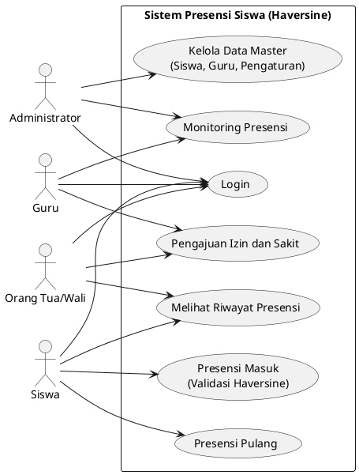

---

## 3. Activity Diagram: Login

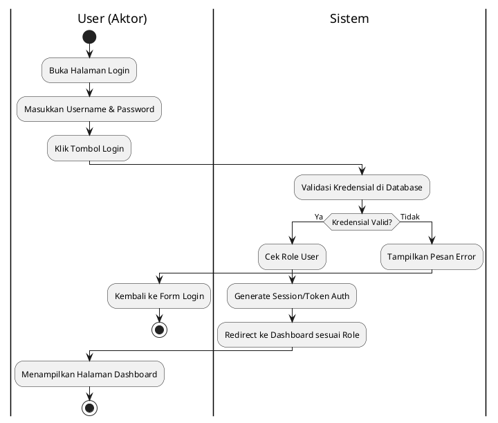

---

## 4. Activity Diagram: Kelola Data Master

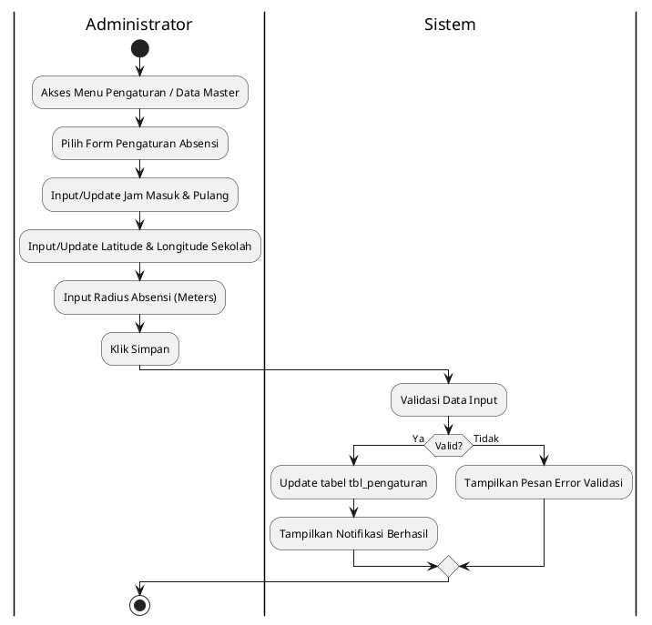

---

## 5. Activity Diagram: Presensi Masuk

*(Fokus pada proses pengambilan lokasi, Haversine, dan validasi radius)*

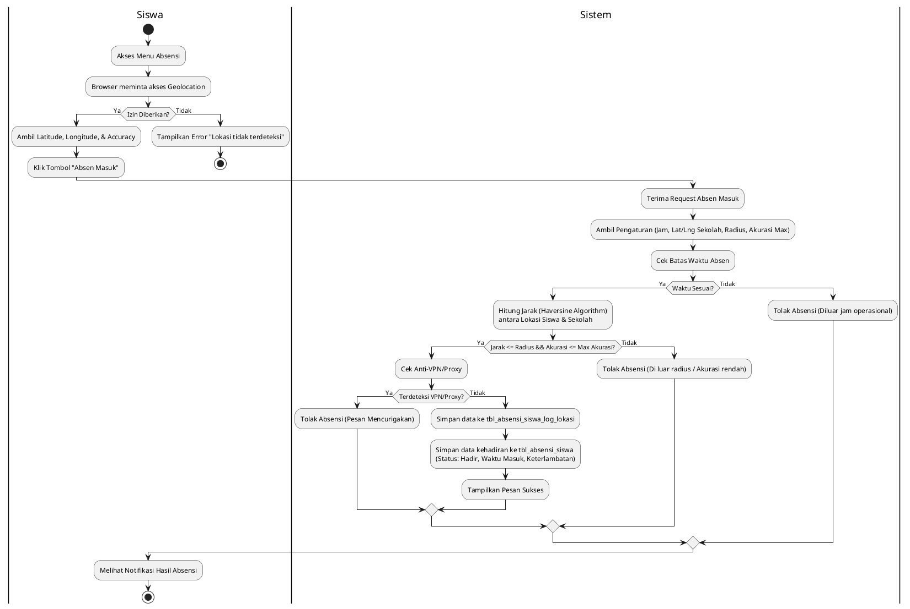

---

## 6. Activity Diagram: Presensi Pulang

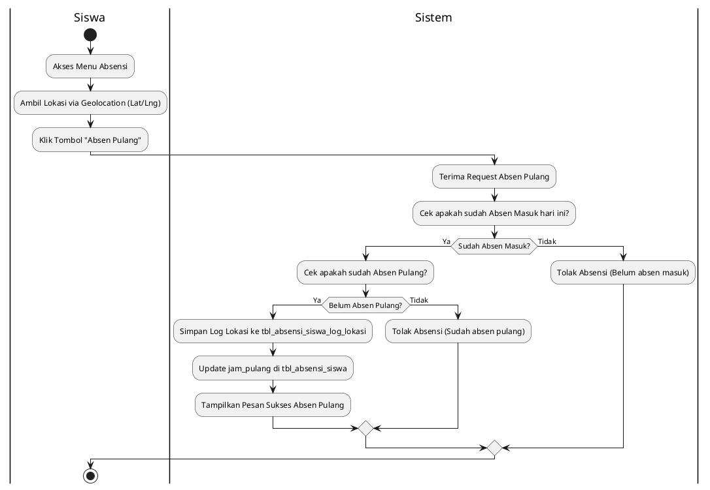

---

## 7. Activity Diagram: Monitoring Presensi

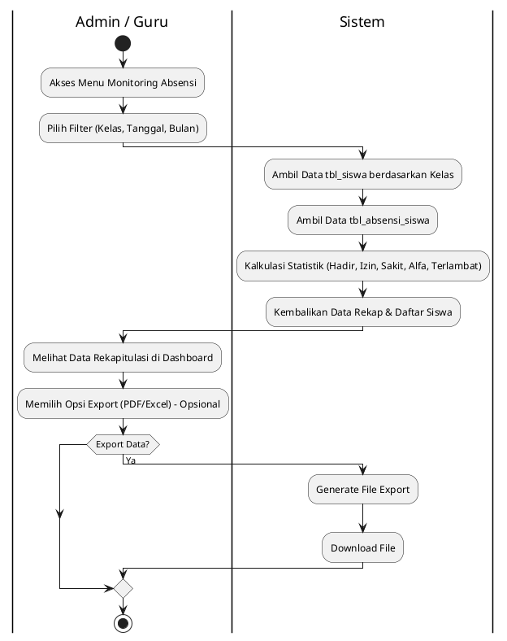

---

## 8. Activity Diagram: Melihat Riwayat Presensi

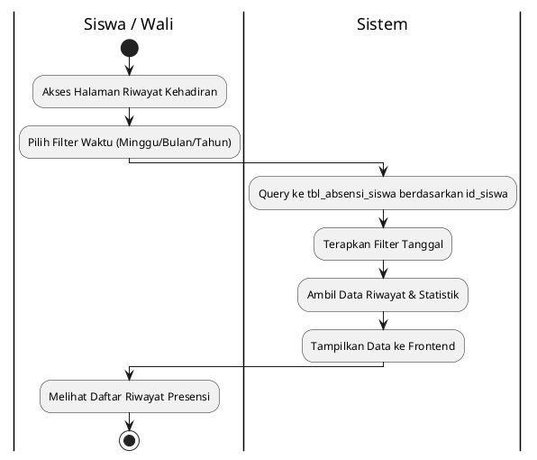

---

## 9. Activity Diagram: Pengajuan Izin dan Sakit

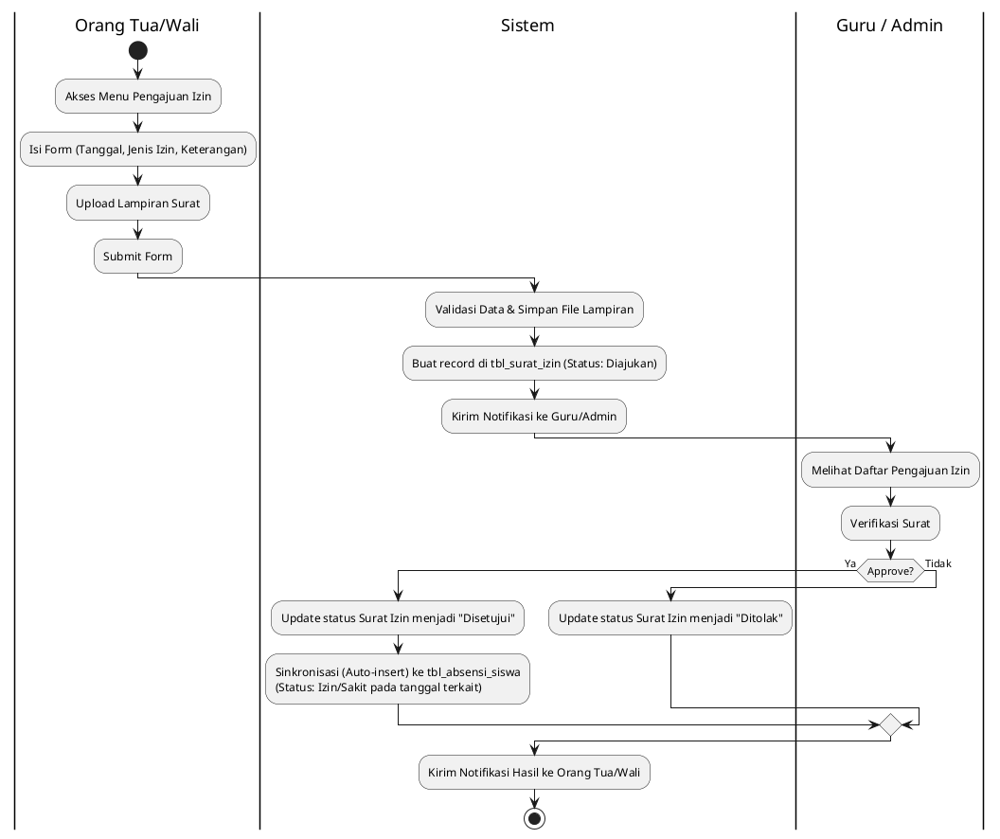

---

## 10. Sequence Diagram: Login

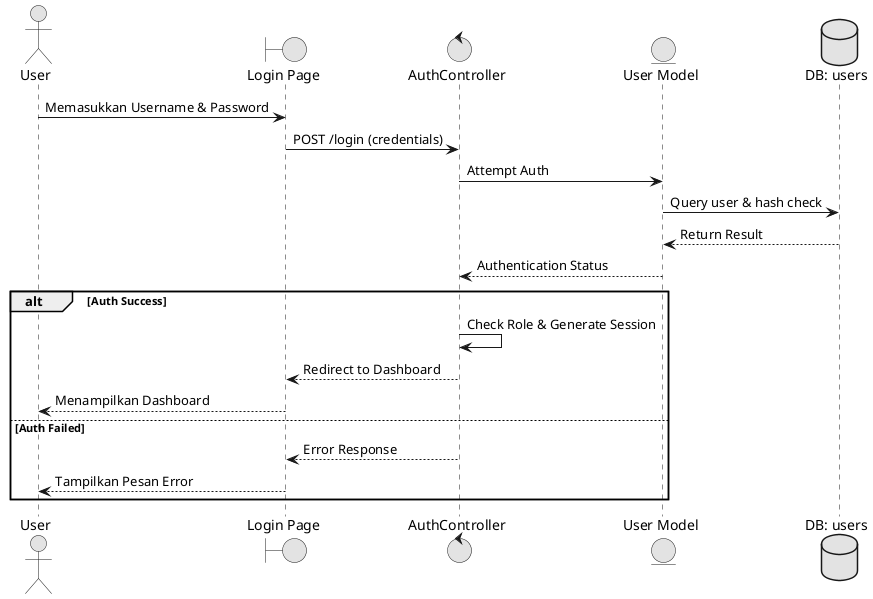

---

## 11. Sequence Diagram: Kelola Data Master

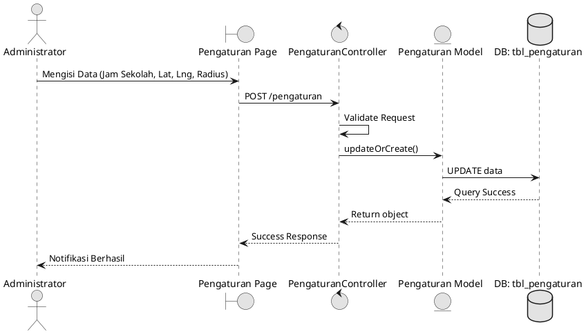

---

## 12. Sequence Diagram: Presensi Masuk (Fokus Haversine)

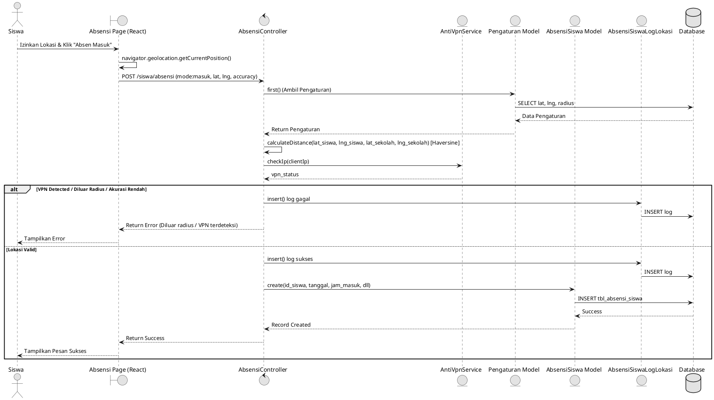

---

## 13. Sequence Diagram: Presensi Pulang

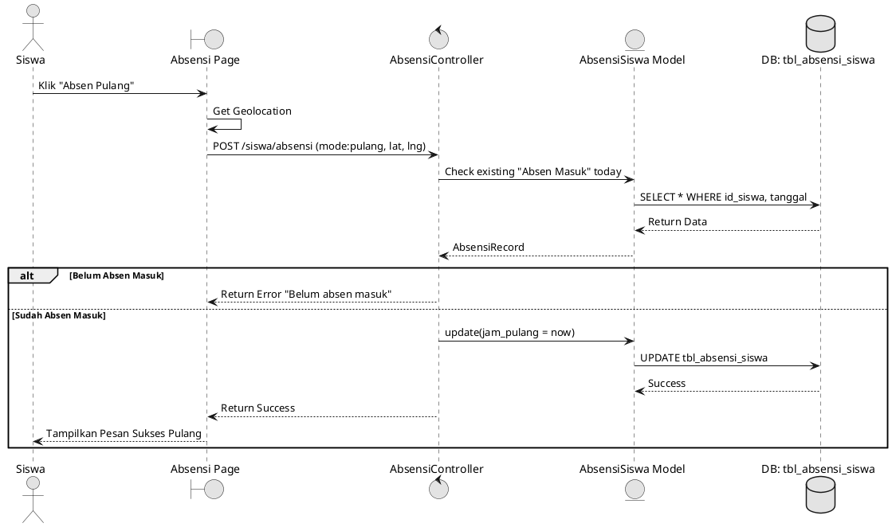

---

## 14. Sequence Diagram: Monitoring Presensi

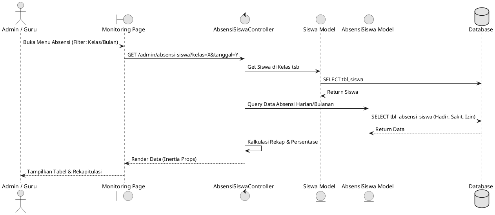

---

## 15. Sequence Diagram: Melihat Riwayat Presensi

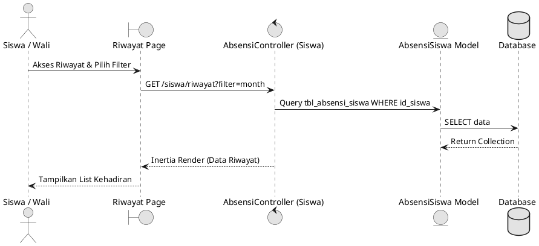

---

## 16. Sequence Diagram: Pengajuan Izin dan Sakit

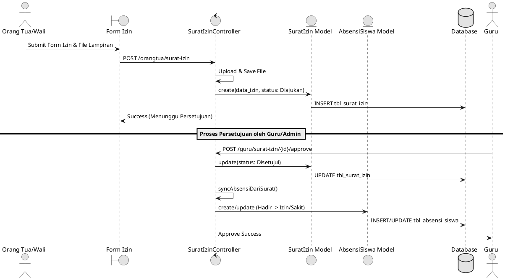

---

## 17. Class Diagram (Final - Tracing dari Sequence)

Berdasarkan *tracing* objek yang muncul di dalam 7 Sequence Diagram di atas, maka Class Diagram yang terbentuk (berfokus pada modul absensi) adalah sebagai berikut:

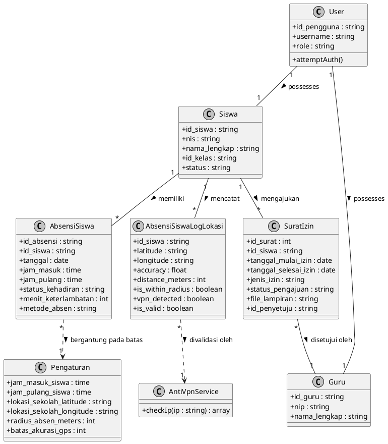

---

## 18. Tabel Tracing (Keterhubungan Antar Diagram)

| Use Case                | Activity Diagram                | Sequence Diagram                | Objek / Model yang Terlibat (Class)                                                        |
| ----------------------- | ------------------------------- | ------------------------------- | ------------------------------------------------------------------------------------------ |
| 1. Login                | Activity - Login                | Sequence - Login                | `User`, `Siswa`, `Guru`                                                              |
| 2. Kelola Data Master   | Activity - Kelola Data Master   | Sequence - Kelola Data Master   | `Pengaturan`                                                                             |
| 3. Presensi Masuk       | Activity - Presensi Masuk       | Sequence - Presensi Masuk       | `Siswa`, `Pengaturan`, `AbsensiSiswa`, `AbsensiSiswaLogLokasi`, `AntiVpnService` |
| 4. Presensi Pulang      | Activity - Presensi Pulang      | Sequence - Presensi Pulang      | `Siswa`, `AbsensiSiswa`, `AbsensiSiswaLogLokasi`                                     |
| 5. Monitoring Presensi  | Activity - Monitoring Presensi  | Sequence - Monitoring Presensi  | `Siswa`, `AbsensiSiswa`                                                                |
| 6. Melihat Riwayat      | Activity - Melihat Riwayat      | Sequence - Melihat Riwayat      | `Siswa`, `AbsensiSiswa`                                                                |
| 7. Pengajuan Izin/Sakit | Activity - Pengajuan Izin/Sakit | Sequence - Pengajuan Izin/Sakit | `Siswa`, `Guru`, `SuratIzin`, `AbsensiSiswa`                                       |

---

*Laporan ini diproduksi berdasarkan penelusuran source code dan ditujukan untuk memenuhi persyaratan sinkronisasi 7 Use Case, 7 Activity, 7 Sequence, dan 1 Class Diagram berfokus pada algoritma Haversine.*
