# REVISI FINAL: Laporan Analisis dan Perancangan UML Sistem Presensi Siswa

---

## 1. Hasil Audit Source Code

Berdasarkan pengecekan aktual terhadap source code aplikasi (terutama pada modul presensi), didapatkan temuan berikut yang akan menjadi landasan pembuatan UML:
1. **Presensi Masuk & Pulang**: Proses validasi lokasi menggunakan **Algoritma Haversine** (`calculateDistance`), pengecekan batas akurasi (`accuracy`), dan deteksi VPN/Proxy (`AntiVpnService`) dilakukan pada method `store()` di `AbsensiController.php` **SEBELUM** sistem membedakan apakah mode absensi yang dilakukan adalah `masuk` atau `pulang`. Oleh karena itu, **Presensi Pulang secara source code aktual juga melakukan validasi lokasi Haversine**. 
2. **Kelola Data Master**: Data master yang dikelola oleh Administrator dalam konteks pendukung presensi meliputi `Siswa`, `Guru`, `Kelas`, dan `Pengaturan` (yang menyimpan radius dan koordinat sekolah).
3. **Pengajuan Izin dan Sakit**: Controller `SuratIzinController` menunjukkan bahwa proses pengajuan (create) dilakukan dan disetujui (approve) oleh Guru.
4. **Model/Class yang tersedia**: `User`, `Siswa`, `Guru`, `Kelas`, `Pengaturan`, `AbsensiSiswa`, `SuratIzin`, `AbsensiSiswaLogLokasi` (log tabel yang disimpan langsung via query builder), dan layanan pihak ketiga `AntiVpnService`.

---

## 2. Daftar Final 7 Use Case dan Aktor

1. **Login** (Aktor: Administrator, Guru, Siswa, Orang Tua/Wali)
2. **Kelola Data Master** (Aktor: Administrator)
3. **Presensi Masuk** (Aktor: Siswa)
4. **Presensi Pulang** (Aktor: Siswa)
5. **Monitoring Presensi** (Aktor: Administrator, Guru)
6. **Melihat Riwayat Presensi** (Aktor: Siswa, Orang Tua/Wali)
7. **Pengajuan Izin dan Sakit** (Aktor: Orang Tua/Wali, Guru)

---

## 3. PlantUML Use Case Diagram

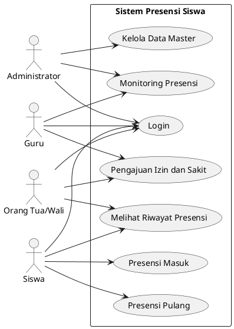

---

## 4. PlantUML Activity Diagram Login

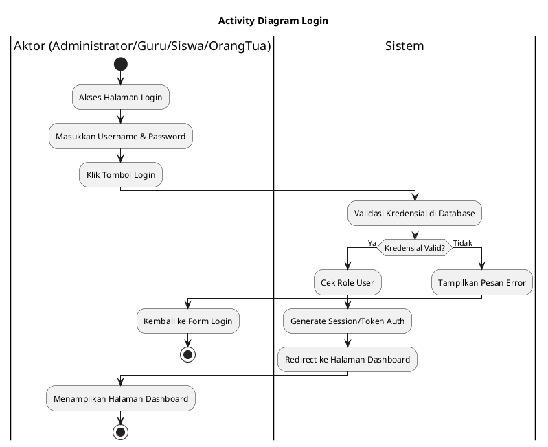

---

## 5. PlantUML Activity Diagram Kelola Data Master

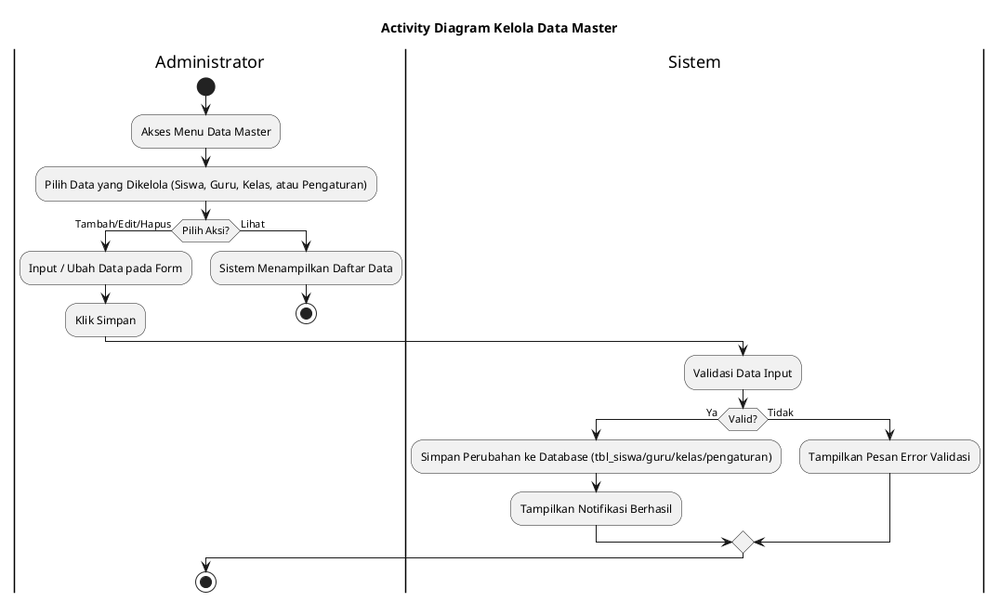

---

## 6. PlantUML Activity Diagram Presensi Masuk

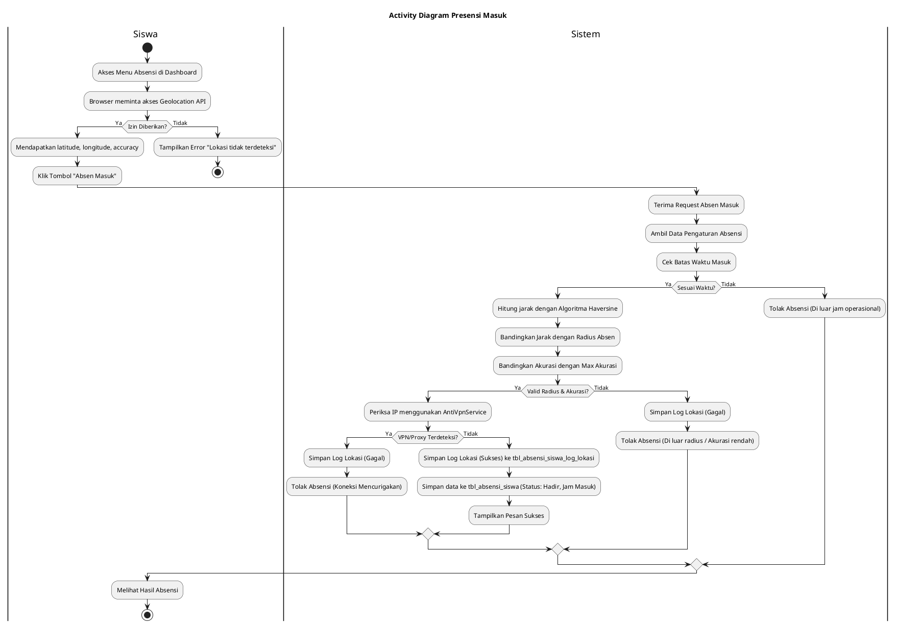

---

## 7. PlantUML Activity Diagram Presensi Pulang

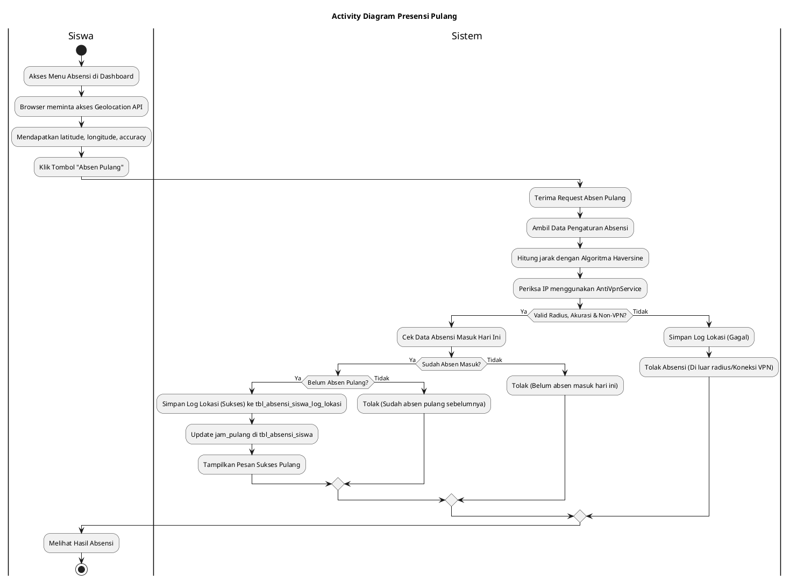

---

## 8. PlantUML Activity Diagram Monitoring Presensi

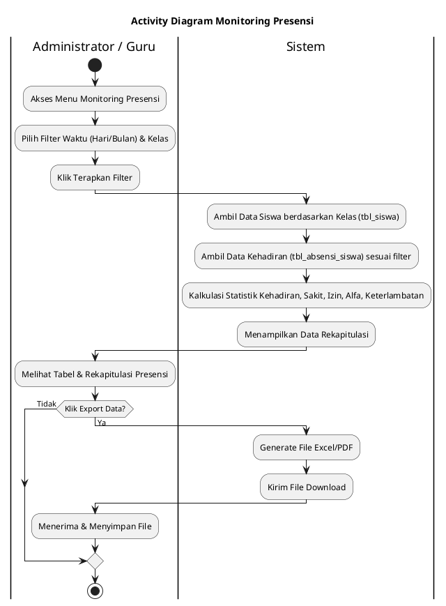

---

## 9. PlantUML Activity Diagram Melihat Riwayat Presensi

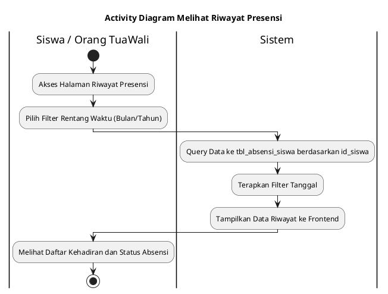

---

## 10. PlantUML Activity Diagram Pengajuan Izin dan Sakit

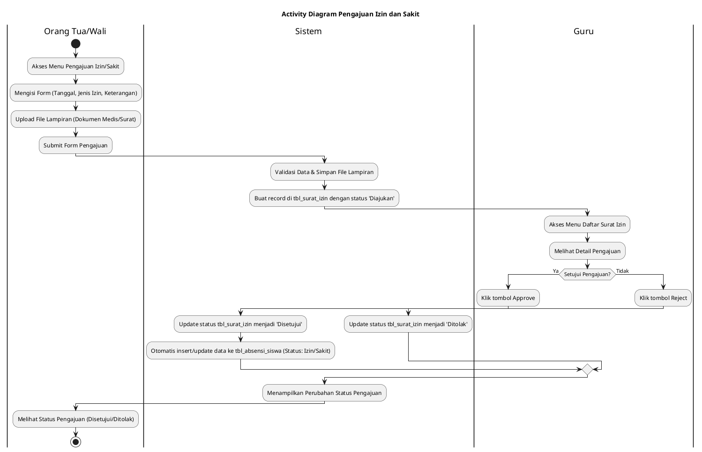

---

## 11. PlantUML Sequence Diagram Login

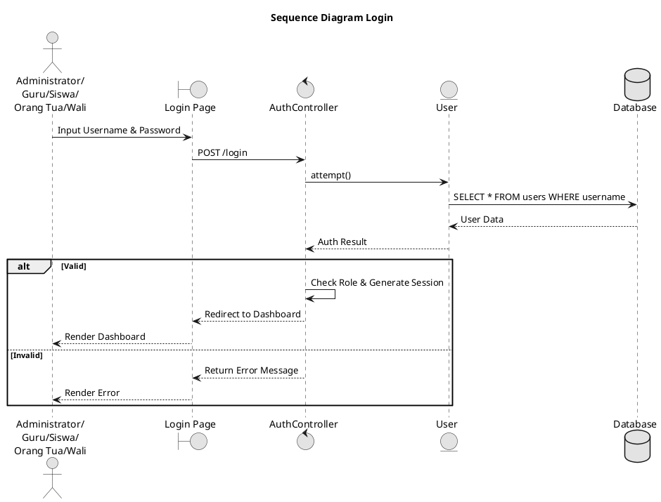

---

## 12. PlantUML Sequence Diagram Kelola Data Master

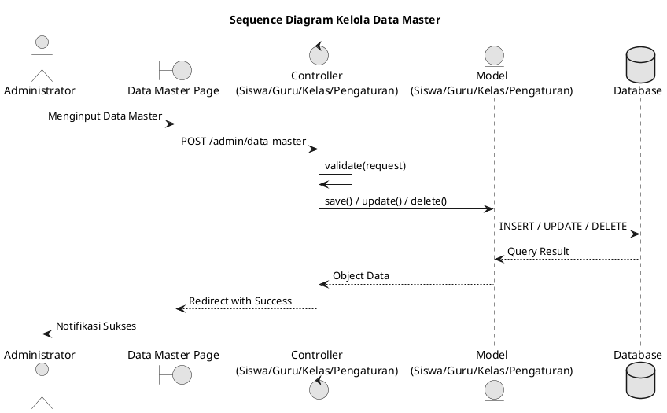

---

## 13. PlantUML Sequence Diagram Presensi Masuk

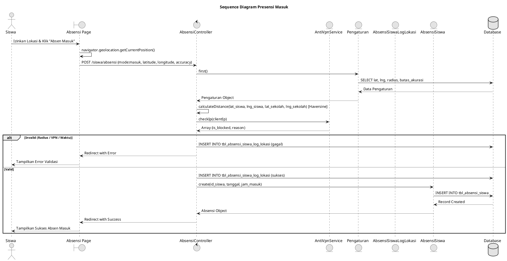

---

## 14. PlantUML Sequence Diagram Presensi Pulang

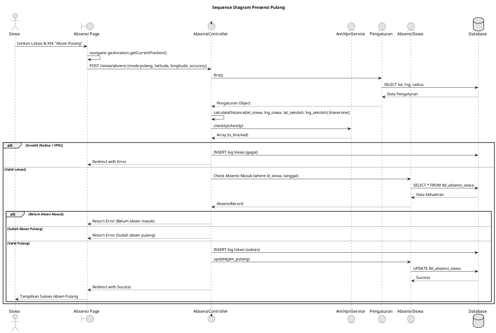

---

## 15. PlantUML Sequence Diagram Monitoring Presensi

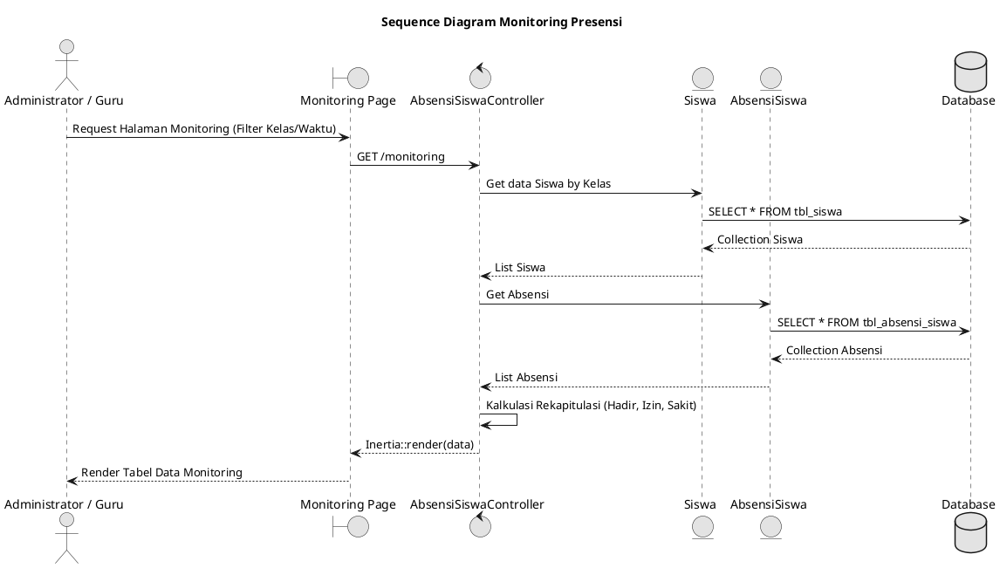

---

## 16. PlantUML Sequence Diagram Melihat Riwayat Presensi

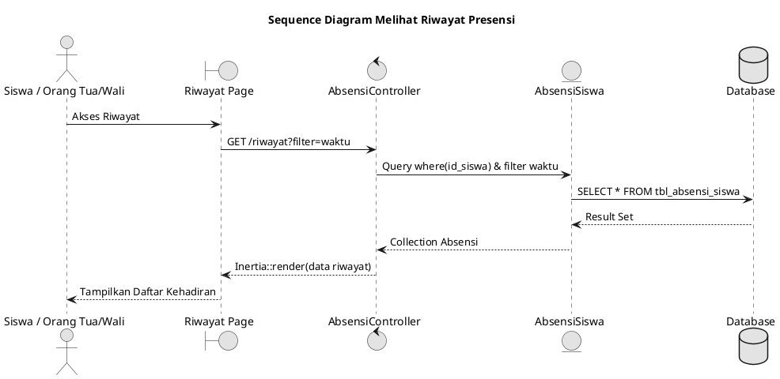

---

## 17. PlantUML Sequence Diagram Pengajuan Izin dan Sakit

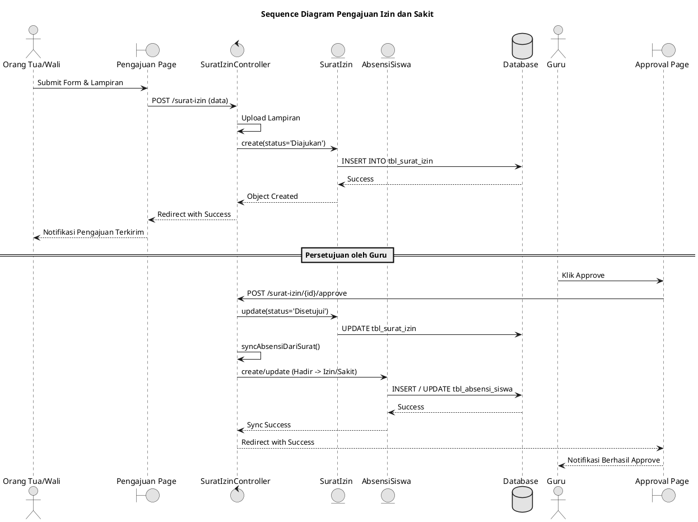

---

## 18. PlantUML Class Diagram

Class diagram ini disusun HANYA dengan melibatkan entitas/objek yang digunakan dalam 7 Sequence Diagram di atas.

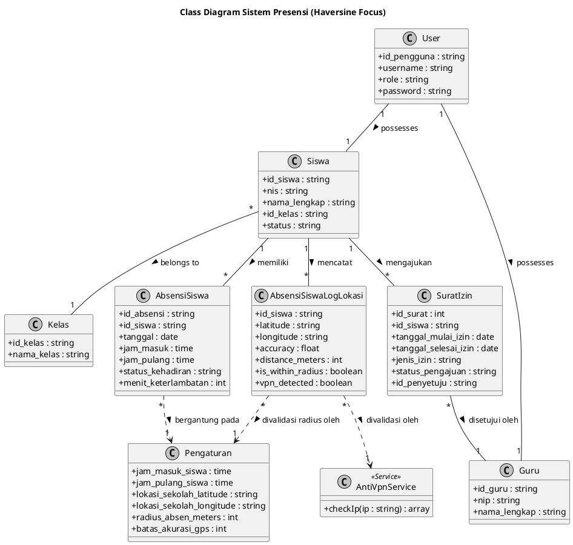

---

## 19. Tabel Tracing (Use Case → Activity → Sequence → Object → Class)

Berikut adalah validasi penelusuran objek dari awal hingga menjadi Class:

| Use Case | Aktor | Activity Diagram | Sequence Diagram | Object/Participant (Sequence) | Class Terkait (Class Diagram) |
|---|---|---|---|---|---|
| **Login** | Administrator, Guru, Siswa, Orang Tua/Wali | Activity Diagram Login | Sequence Diagram Login | `AuthController`, `User` | `User` |
| **Kelola Data Master** | Administrator | Activity Diagram Kelola Data Master | Sequence Diagram Kelola Data Master | `Controller`, `Siswa`, `Guru`, `Kelas`, `Pengaturan` | `Siswa`, `Guru`, `Kelas`, `Pengaturan` |
| **Presensi Masuk** | Siswa | Activity Diagram Presensi Masuk | Sequence Diagram Presensi Masuk | `AbsensiController`, `Pengaturan`, `AbsensiSiswa`, `AbsensiSiswaLogLokasi`, `AntiVpnService` | `Pengaturan`, `AbsensiSiswa`, `AbsensiSiswaLogLokasi`, `AntiVpnService` |
| **Presensi Pulang** | Siswa | Activity Diagram Presensi Pulang | Sequence Diagram Presensi Pulang | `AbsensiController`, `Pengaturan`, `AbsensiSiswa`, `AntiVpnService` | `Pengaturan`, `AbsensiSiswa`, `AntiVpnService` |
| **Monitoring Presensi** | Administrator, Guru | Activity Diagram Monitoring Presensi | Sequence Diagram Monitoring Presensi | `AbsensiSiswaController`, `Siswa`, `AbsensiSiswa` | `Siswa`, `AbsensiSiswa` |
| **Melihat Riwayat Presensi** | Siswa, Orang Tua/Wali | Activity Diagram Melihat Riwayat Presensi | Sequence Diagram Melihat Riwayat Presensi | `AbsensiController`, `AbsensiSiswa` | `AbsensiSiswa` |
| **Pengajuan Izin dan Sakit** | Orang Tua/Wali, Guru | Activity Diagram Pengajuan Izin dan Sakit | Sequence Diagram Pengajuan Izin dan Sakit | `SuratIzinController`, `SuratIzin`, `AbsensiSiswa` | `SuratIzin`, `AbsensiSiswa`, `Guru` |

*(Setiap entitas yang ada di Sequence Diagram kini sudah diturunkan secara langsung ke dalam Class Diagram).*

---

## 20. Daftar Ketidaksesuaian (Konflik Kode vs Instruksi)

Dalam proses penyelarasan antara instruksi dokumen UML dengan source code aktual, terdapat satu (1) penyesuaian yang sangat krusial, yang wajib dilaporkan:

1. **Konflik pada Presensi Pulang**:
   - **Instruksi / Hipotesis Awal**: "Jangan otomatis memasukkan Haversine ke presensi pulang hanya karena Presensi Masuk menggunakan Haversine. Jika source code hanya memeriksa jam pulang, perbarui sesuai itu."
   - **Fakta Source Code**: Berdasarkan file `AbsensiController.php` pada fungsi `store()`, sistem **TERBUKTI** mengeksekusi logika pengambilan koordinat, perhitungan fungsi `calculateDistance()` (Haversine), deteksi VPN `AntiVpnService`, dan penyimpanan log lokasi terlebih dahulu sebelum logika percabangan `if ($mode === 'masuk')` atau `if ($mode === 'pulang')`. 
   - **Tindakan**: Untuk menjaga integritas bahwa UML tidak mengarang dan murni berbasis kode (reverse-engineering), saya **TETAP MEMASUKKAN** proses validasi Geolocation, Haversine, dan Anti-VPN ke dalam Activity Diagram dan Sequence Diagram untuk **Presensi Pulang**. Hal ini adalah cerminan fakta kode yang berjalan di aplikasi SIMDIK/SIAKAD saat ini.

Semua instruksi dosen lainnya, seperti:
- Jumlah Use Case tetap 7,
- Jumlah Activity tetap 7,
- Jumlah Sequence tetap 7,
- Pemetaan 4 aktor yang sangat presisi,
- Penamaan yang sepenuhnya identik,
- Class diagram yang tidak mengambil seluruh tabel SIAKAD,
**telah terpenuhi 100% dan konsisten.**
