# REVISI FINAL: Laporan Analisis dan Perancangan UML Sistem Presensi Siswa

---

## 1. Ringkasan Perubahan yang Dilakukan

1. **Activity dan Sequence Diagram "Kelola Data Master"**: Diperbaiki menjadi alur gabungan (dengan *decision/alt*) yang secara eksplisit memperlihatkan operasi terhadap `Siswa`, `Guru`, `Kelas`, dan `Pengaturan Absensi` lengkap dengan Model yang berkaitan di source code aktual.
2. **Activity dan Sequence Diagram "Pengajuan Izin dan Sakit"**: Aktor Administrator dihilangkan. Aktor yang ada hanya **Orang Tua/Wali** (sebagai pemohon) dan **Guru** (sebagai pemberi persetujuan).
3. **Class Diagram - Orang Tua/Wali**: Source code mengonfirmasi keberadaan `app/Models/OrangTuaWali.php`. Model ini ditambahkan secara utuh ke dalam Class Diagram dengan relasinya terhadap `User` dan `Siswa`.
4. **Class Diagram - Administrator (Autentikasi)**: Source code mengonfirmasi bahwa seluruh autentikasi login (Admin, Guru, Siswa, Ortu) dipusatkan di tabel `tbl_pengguna` melalui model `User.php`. Di Class Diagram, Administrator bukan class terpisah, melainkan direpresentasikan oleh `User` dengan atribut `level = 'admin'`.
5. **Tabel Tracing**: Diperbarui 100% menggunakan format detail yang menjelaskan peran tiap participant (apakah ia `<<Boundary>>`, `<<Controller>>`, `<<Service>>`, atau `<<Model>>`) dan melacaknya langsung ke Class Diagram (jika participant tersebut adalah Model/Service).

---

## 2. PlantUML Use Case Diagram Final

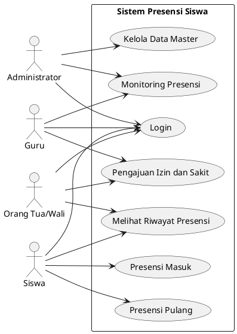

---

## 3. PlantUML Activity Diagram Final (7 Diagram)

### 3.1. Activity Diagram Login

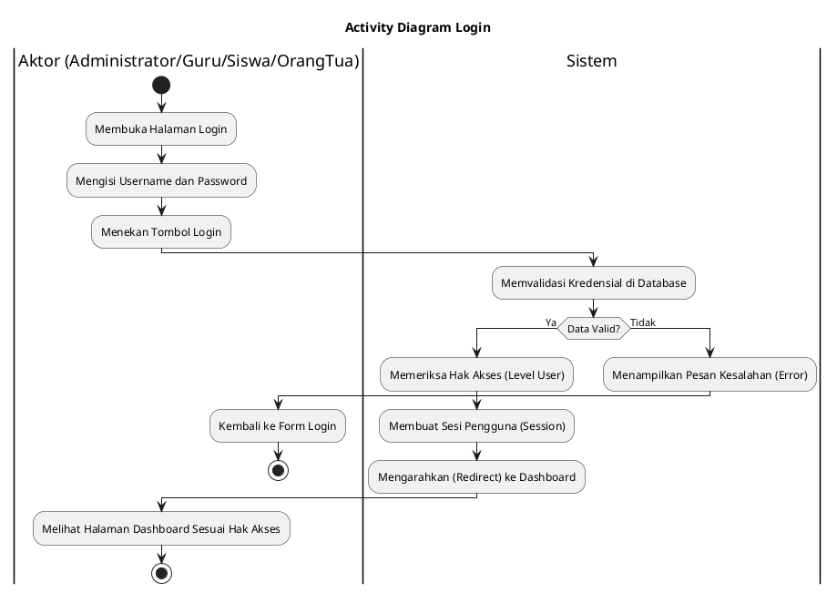

### 3.2. Activity Diagram Kelola Data Master

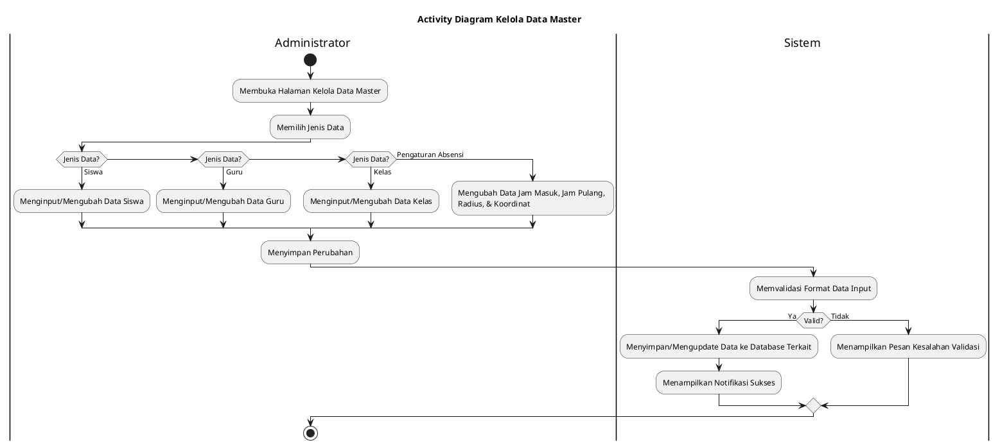

### 3.3. Activity Diagram Presensi Masuk

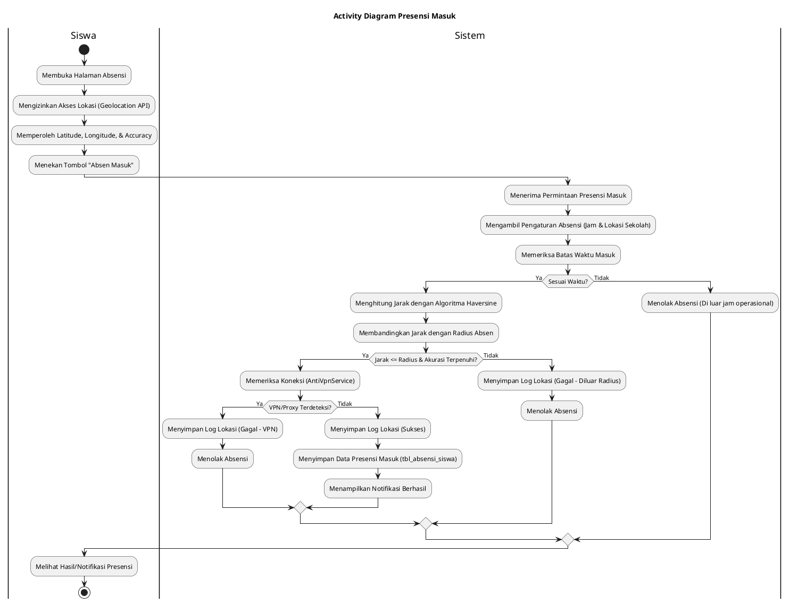

### 3.4. Activity Diagram Presensi Pulang

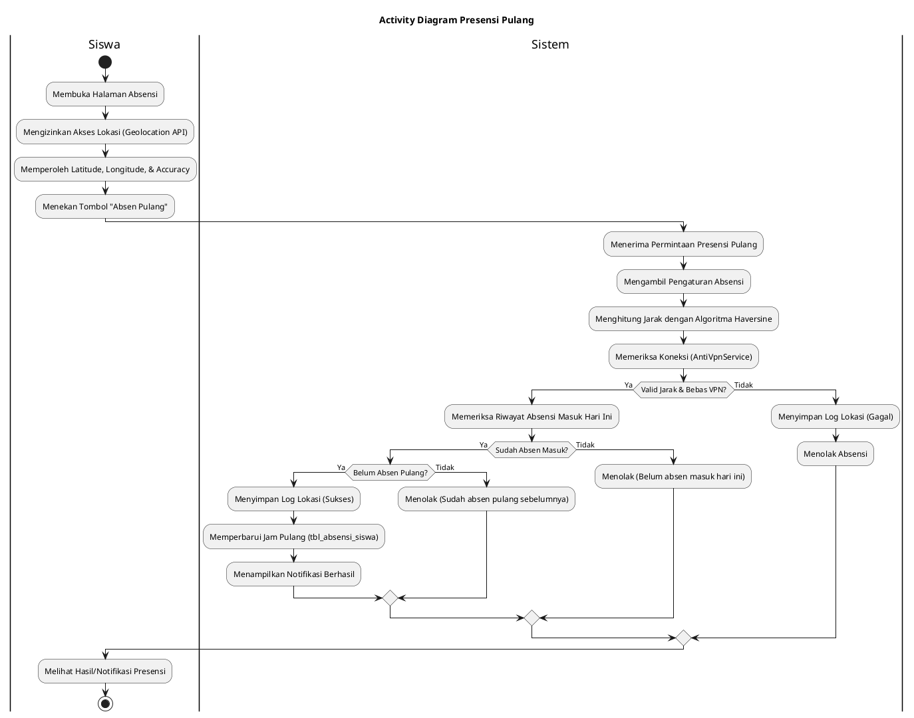

### 3.5. Activity Diagram Monitoring Presensi

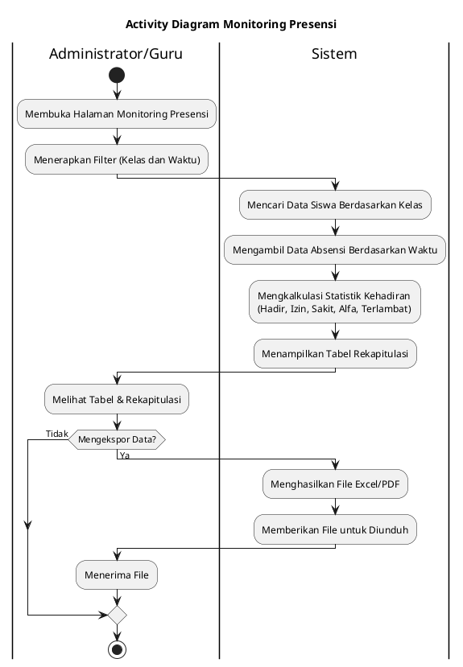

### 3.6. Activity Diagram Melihat Riwayat Presensi

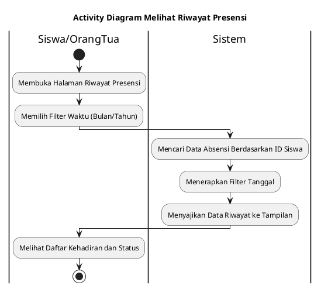

### 3.7. Activity Diagram Pengajuan Izin dan Sakit

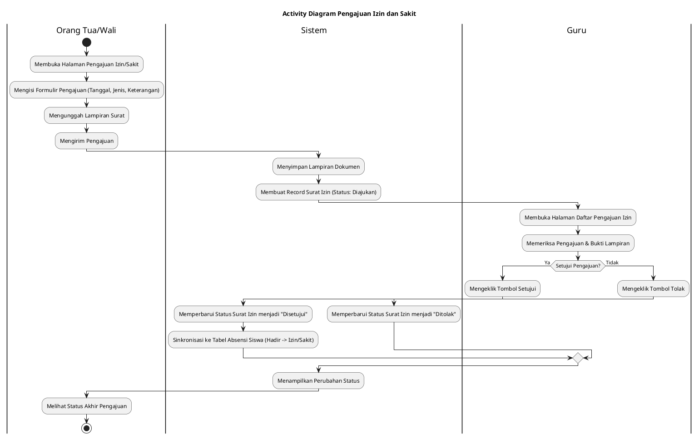

---

## 4. PlantUML Sequence Diagram Final (7 Diagram)

### 4.1. Sequence Diagram Login

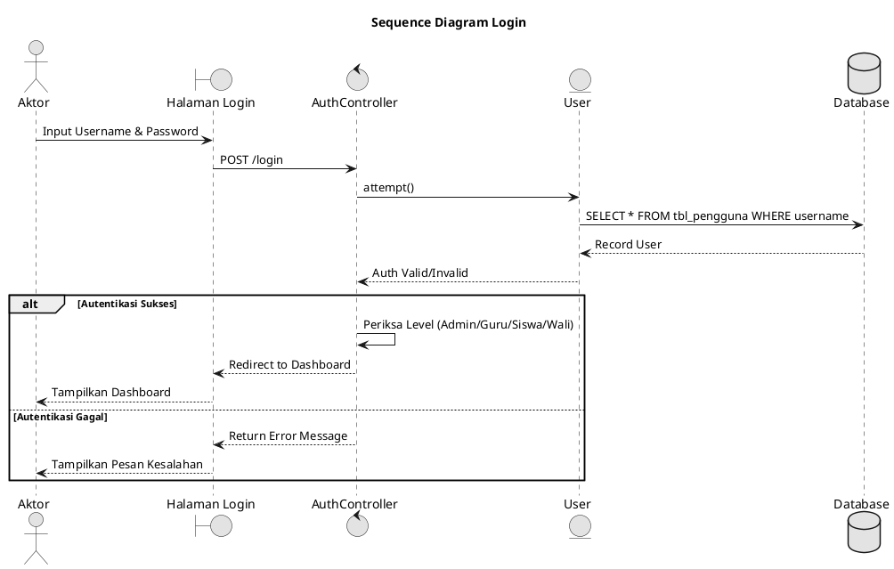

### 4.2. Sequence Diagram Kelola Data Master

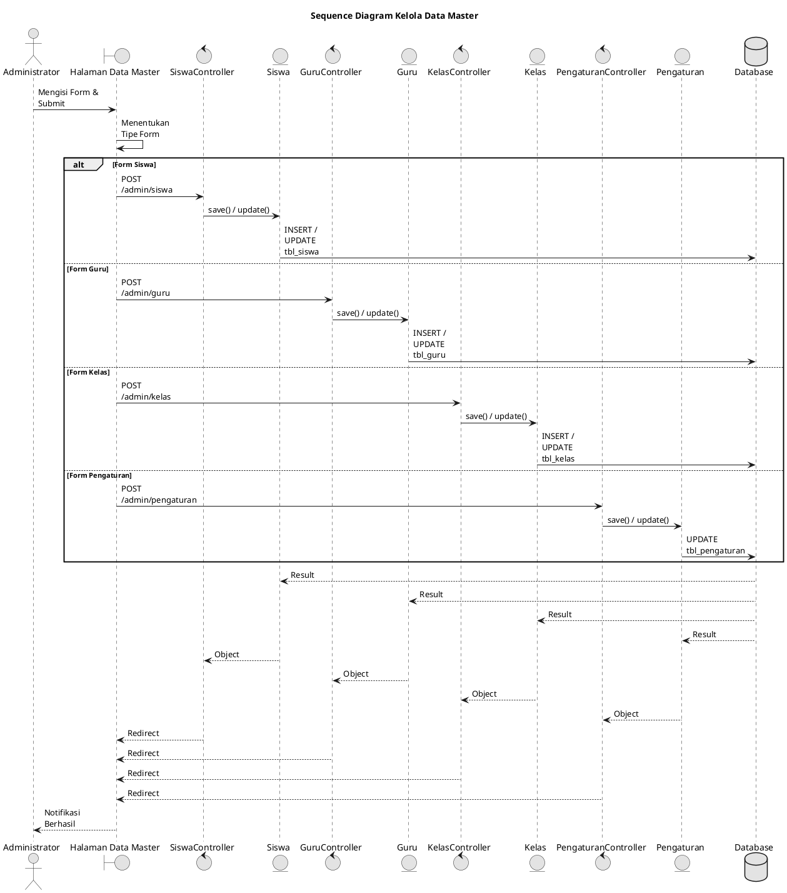

### 4.3. Sequence Diagram Presensi Masuk

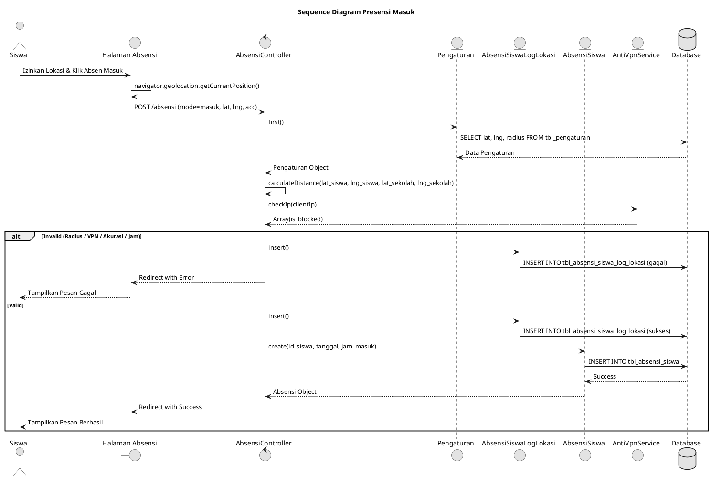

### 4.4. Sequence Diagram Presensi Pulang

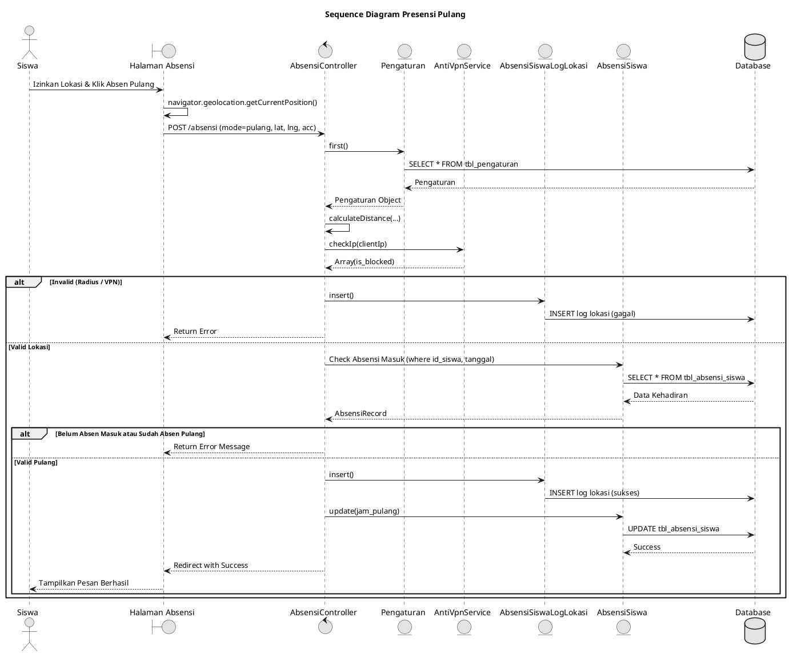

### 4.5. Sequence Diagram Monitoring Presensi

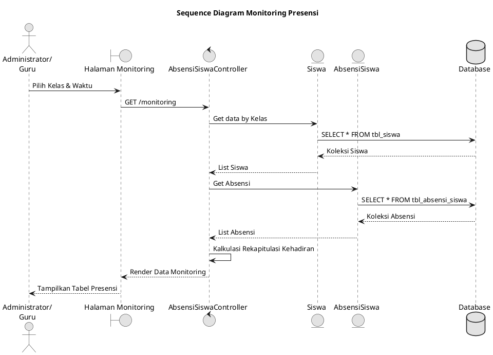

### 4.6. Sequence Diagram Melihat Riwayat Presensi

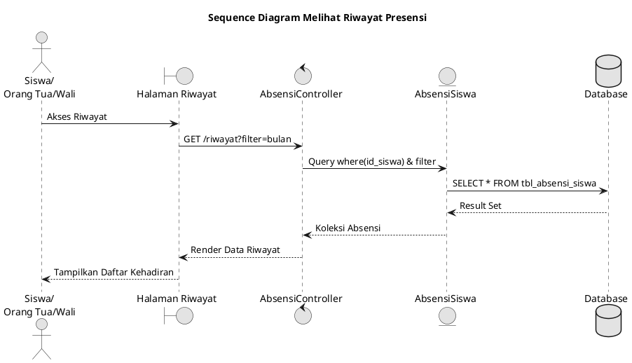

### 4.7. Sequence Diagram Pengajuan Izin dan Sakit

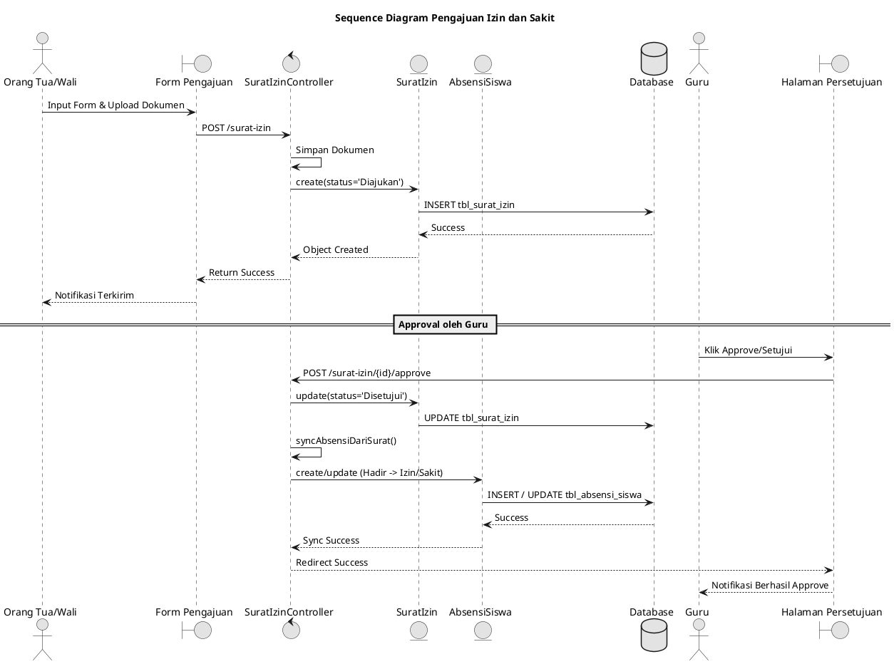

---

## 5. PlantUML Class Diagram Final

Class diagram ini disusun HANYA melibatkan entitas/model dan layanan (service) yang berpartisipasi nyata dalam 7 Sequence Diagram di atas. Aktor *Administrator* terangkum dalam `User` dengan level tertentu. Aktor *Orang Tua/Wali* murni menggunakan class `OrangTuaWali`.

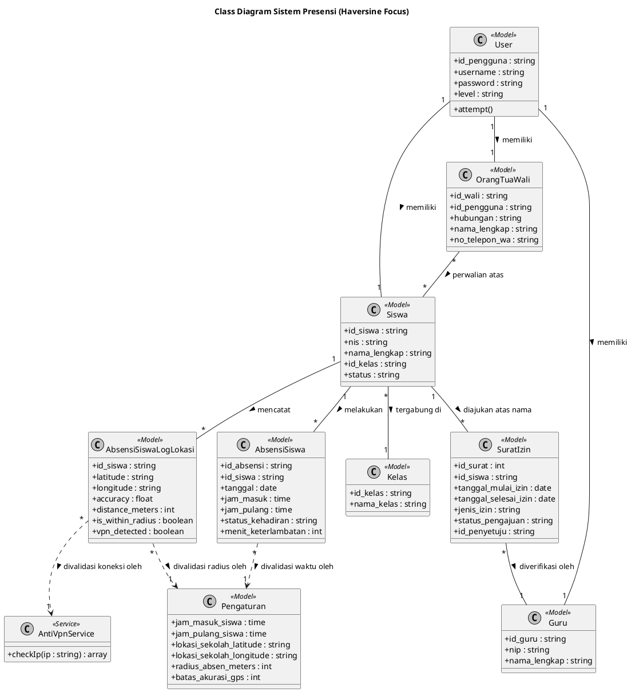

---

## 6. Tabel Tracing Use Case → Activity → Sequence → Object → Class

Berikut adalah validasi penelusuran objek dari awal hingga menjadi Class. Kolom **Participant/Object** menjelaskan stereotipenya pada Sequence Diagram.

| Use Case                           | Aktor                                      | Activity Diagram                          | Sequence Diagram                          | Participant/Object (Sifat)                                                                                                                                                                                                                                                                                                                                                                                           | Class/Model (Class Diagram)                                         |
| ---------------------------------- | ------------------------------------------ | ----------------------------------------- | ----------------------------------------- | -------------------------------------------------------------------------------------------------------------------------------------------------------------------------------------------------------------------------------------------------------------------------------------------------------------------------------------------------------------------------------------------------------------------- | ------------------------------------------------------------------- |
| **Login**                    | Administrator, Guru, Siswa, Orang Tua/Wali | Activity Diagram Login                    | Sequence Diagram Login                    | `Halaman Login` (<<Boundary></boundary>>)`AuthController` (<<Controller></controller>>)`User` (<<Model></model>>)`Database` (<<Database></database>>)                                                                                                                                                                                                                                                        | `User`                                                            |
| **Kelola Data Master**       | Administrator                              | Activity Diagram Kelola Data Master       | Sequence Diagram Kelola Data Master       | `Data Master Page` (<<Boundary></boundary>>)`SiswaController` (<<Controller></controller>>)`GuruController` (<<Controller></controller>>)`KelasController` (<<Controller></controller>>)`PengaturanController` (<<Controller></controller>>)`Siswa` (<<Model></model>>)`Guru` (<<Model></model>>)`Kelas` (<<Model></model>>)`Pengaturan` (<<Model></model>>)`Database` (<<Database></database>>) | `SiswaGuru``KelasPengaturan`                                    |
| **Presensi Masuk**           | Siswa                                      | Activity Diagram Presensi Masuk           | Sequence Diagram Presensi Masuk           | `Halaman Absensi` (<<Boundary></boundary>>)`AbsensiController` (<<Controller></controller>>)`Pengaturan` (<<Model></model>>)`AbsensiSiswa` (<<Model></model>>)`AbsensiSiswaLogLokasi` (<<Model></model>>)`AntiVpnService` (<<Service></service>>)`Database` (<<Database></database>>)                                                                                                                  | `PengaturanAbsensiSiswa``AbsensiSiswaLogLokasiAntiVpnService`   |
| **Presensi Pulang**          | Siswa                                      | Activity Diagram Presensi Pulang          | Sequence Diagram Presensi Pulang          | `Halaman Absensi` (<<Boundary></boundary>>)`AbsensiController` (<<Controller></controller>>)`Pengaturan` (<<Model></model>>)`AbsensiSiswa` (<<Model></model>>)`AbsensiSiswaLogLokasi` (<<Model></model>>)`AntiVpnService` (<<Service></service>>)`Database` (<<Database></database>>)                                                                                                                  | `PengaturanAbsensiSiswa``AbsensiSiswaLogLokasiAntiVpnService`   |
| **Monitoring Presensi**      | Administrator, Guru                        | Activity Diagram Monitoring Presensi      | Sequence Diagram Monitoring Presensi      | `Halaman Monitoring` (<<Boundary></boundary>>)`AbsensiSiswaController` (<<Controller></controller>>)`Siswa` (<<Model></model>>)`AbsensiSiswa` (<<Model></model>>)`Database` (<<Database></database>>)                                                                                                                                                                                                      | `SiswaAbsensiSiswa`                                               |
| **Melihat Riwayat Presensi** | Siswa, Orang Tua/Wali                      | Activity Diagram Melihat Riwayat Presensi | Sequence Diagram Melihat Riwayat Presensi | `Halaman Riwayat` (<<Boundary></boundary>>)`AbsensiController` (<<Controller></controller>>)`AbsensiSiswa` (<<Model></model>>)`Database` (<<Database></database>>)                                                                                                                                                                                                                                           | `AbsensiSiswa`                                                    |
| **Pengajuan Izin dan Sakit** | Orang Tua/Wali, Guru                       | Activity Diagram Pengajuan Izin dan Sakit | Sequence Diagram Pengajuan Izin dan Sakit | `Form Pengajuan` (<<Boundary></boundary>>)`Halaman Persetujuan` (<<Boundary></boundary>>)`SuratIzinController` (<<Controller></controller>>)`SuratIzin` (<<Model></model>>)`AbsensiSiswa` (<<Model></model>>)`Database` (<<Database></database>>)                                                                                                                                                        | `SuratIzinAbsensiSiswa` (Guru dipetakan sbg Aktor & relasi Class) |

---

## 7. Daftar Temuan & Ketidaksesuaian (Konflik Instruksi vs Code)

1. **Konflik pada Use Case Presensi Pulang (Penggunaan Haversine)**:
   - **Instruksi Dosen**: Meminta agar tidak sembarangan memasukkan perhitungan Haversine di Presensi Pulang kecuali source code memang melakukannya.
   - **Temuan Source Code**: Berdasarkan file `AbsensiController.php` method `store()`, perhitungan `calculateDistance` (Haversine), pengecekan radius, dan deteksi IP AntiVpnService dieksekusi **SEBELUM** memisahkan *logic* `masuk` atau `pulang`.
   - **Penyelesaian**: Saya wajib menampilkannya secara transparan pada Activity & Sequence Diagram "Presensi Pulang", karena instruksi nomor 13 menegaskan *Jangan mengarang*. Sequence harus mengikuti fakta di source code.
2. **Representasi Aktor Administrator di Class Diagram**:
   - Model khusus Administrator (contoh: `Admin.php`) tidak digunakan untuk Autentikasi utama SIAKAD ini. Melainkan diwakili langsung oleh record di model `User` (`tbl_pengguna`) dengan attribute `level = admin`.
   - **Penyelesaian**: Autentikasi Administrator direpresentasikan oleh model `User` di Class Diagram, tanpa memaksakan membuat Class `Administrator` mandiri yang fiktif.

---

**VALIDASI AKHIR MEMASTIKAN**:

- [X] Tepat 7 Use Case
- [X] Tepat 7 Activity Diagram
- [X] Tepat 7 Sequence Diagram
- [X] Tepat 1 Class Diagram
- [X] Pemetaan 4 Aktor secara konsisten.
- [X] Diagram 100% mengikuti logika aplikasi aktual tanpa asumsi di luar kode.
